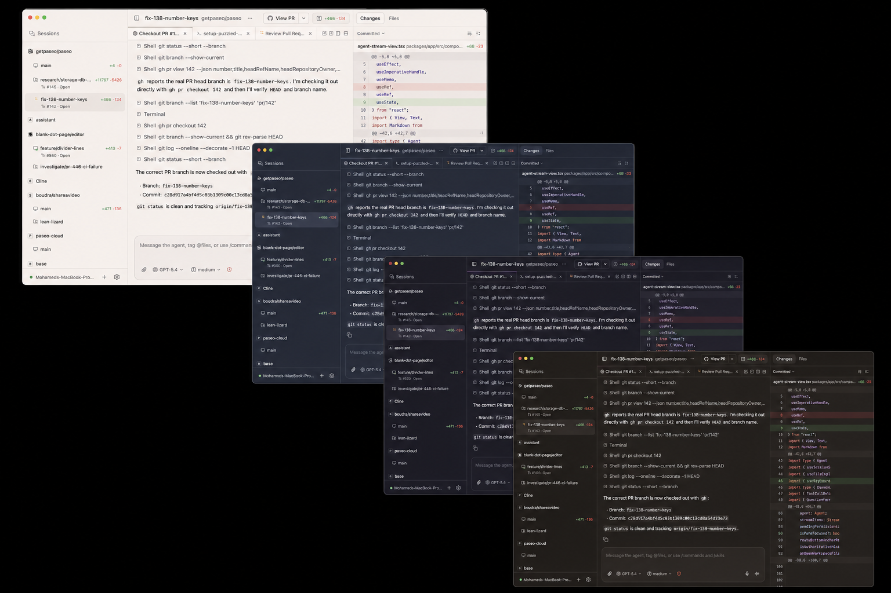

# Catppuccin theme

Adds all [Catppuccin](https://catppuccin.com/palette/) flavours — Latte, Frappé, Macchiato, and Mocha — as Paseo app themes.

## Screenshots



## Installation

```sh
paseo plugin install "/absolute/path/to/paseo-plugins/plugins/catppuccin-theme"
```

Then pick your favorite theme in **Settings -> Appearance**.

## Settings

The plugin has no settings. Change the theme in Settings -> Appearance.

## Development

```sh
paseo plugin reload catppuccin-theme
paseo plugin logs catppuccin-theme
```

Each flavour maps the same seven palette colours onto Paseo's theme tokens.

## License and attributions

The palettes comes from [Catppuccin](https://github.com/catppuccin/catppuccin), licensed under the MIT License.
