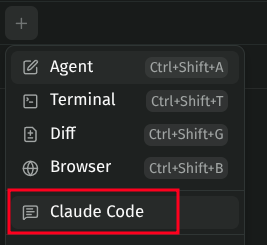
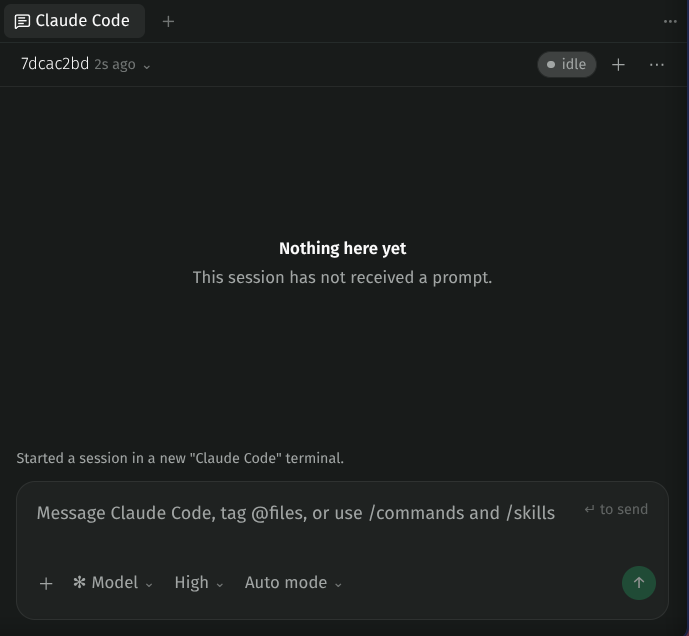
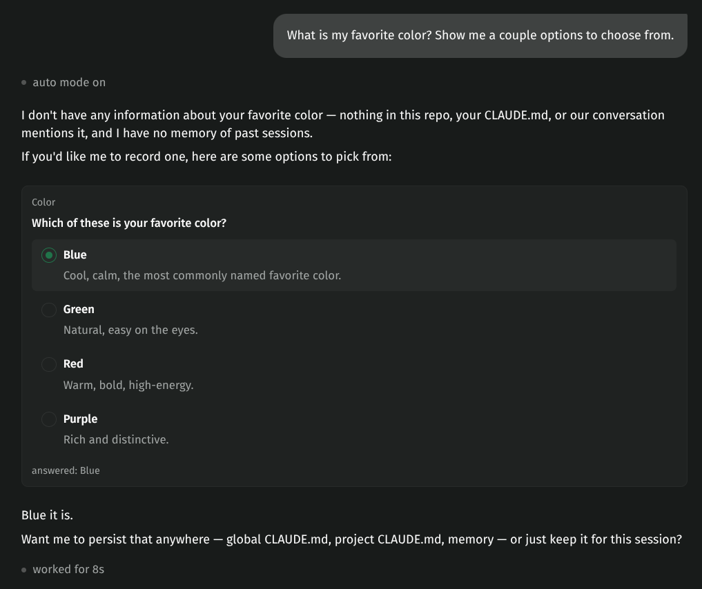

# Claude Code panel

View and control local Claude Code CLI sessions from a Paseo workspace panel.

The plugin runs the real `claude` CLI in a Paseo terminal, reads its transcripts from `~/.claude/projects/`, and sends your input back to the terminal. Sessions keep their normal CLI billing and continue to sync with Claude's mobile and web apps.

## Why

Paseo normally runs Claude through the Claude Agent SDK. In practice, Agent SDK integrations appear to use limits faster than the Claude Code CLI or VS Code extension, as [reported for t3code and similar tools](https://github.com/pingdotgg/t3code/issues/7338#issuecomment-5426425282). It is unclear whether this comes from the SDK, its integrations, or Anthropic's backend.

This plugin avoids the Agent SDK by connecting Paseo directly to the CLI. The trade-off is that features from Paseo's built-in agent view must be recreated from terminal output and transcript files.

## Features

- Render messages, markdown, tool calls, diffs, thinking, tasks, images, and subagents.
- Send prompts with `@` file completion and `/` skill or command completion. On desktop, Enter sends and Shift+Enter adds a line; on mobile, Enter adds a line and the send button sends.
- Attach images, local files, paths, GitHub issues, and pull requests. The file picker reads from the device showing Paseo, while typed paths refer to files on the daemon's machine and are not copied.
- Change the model, effort, thinking, and permission mode through the CLI's controls.
- Answer permission prompts and questions from the panel.
- Browse workspace sessions and see which one is active.
- Avoid duplicate Paseo notifications while viewing the panel.

## Screenshots







## Installation

```sh
paseo plugin install "/absolute/path/to/paseo-plugins/plugins/claude-code-panel"
```

Open a workspace and select **Claude Code** from the workspace panels or Command Center.

The first time you open the panel, enable **terminal agent hooks** when prompted. Paseo adds them to your global `~/.claude/settings.json`, but they only report status for Paseo-owned terminals and do nothing elsewhere. The panel remains read-only until they are enabled.

## Settings

Use the **⋯** menu to choose how prompts are sent:

- **CLI default** sends immediately and lets Claude Code queue or steer the prompt.
- **Hold until idle** waits for the current turn to finish.
- **Interrupt first** stops the current turn before sending.

Supported environment variables:

- `PASEO_BIN` sets the path to the `paseo` CLI when it cannot be found automatically.
- `PASEO_PASSWORD` must be set on the daemon when it has a password configured, so the panel can drive the `paseo` CLI.
- `CLAUDE_CONFIG_DIR` changes where the plugin looks for Claude Code transcripts.

GitHub issue and pull request search uses your installed `gh` CLI. Uploaded files are cached with the plugin settings and removed after one week.

## Troubleshooting

- Session status is reported per workspace, so activity in another terminal can affect the status shown in the panel.
- The file picker is available on web. On mobile, attach a file by entering its path.
- If the plugin cannot recognize a CLI dialog, open the terminal and answer it there.
- `/clear` starts a new session rather than emptying the current one, and the panel follows it as soon as the next prompt is sent. Clearing from the terminal itself is only noticed on that next prompt.
- If no terminal is ever found, check whether your daemon has a password set (`auth.password` in `~/.paseo/config.json`). The panel drives the `paseo` CLI, which takes that password only from `PASEO_PASSWORD`, and the daemon does not set it for the plugins it spawns. Confirm with `paseo terminal ls --all --json`: a password-protected daemon answers `DAEMON_NOT_RUNNING` with "Password required" even though it is running fine. Put `PASEO_PASSWORD` in the daemon's environment — under systemd, an `EnvironmentFile=` keeps it out of a unit file you may be tracking in git.

Run `paseo plugin logs claude-code-panel` for more detail.

## Development

```sh
pnpm typecheck
pnpm test
paseo plugin reload claude-code-panel
paseo plugin logs claude-code-panel
```

Paseo builds client and server bundles from `index.ts`. Client code lives in `src/client`, server code in `src/server`, and shared contracts in `*.shared.ts` files.
