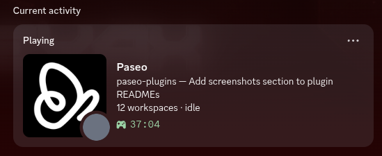
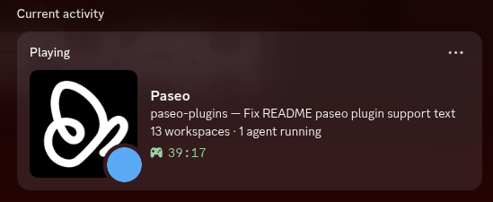
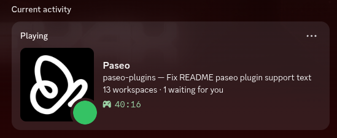

# Discord Rich Presence

Show your current Paseo activity on Discord. The Paseo daemon and Discord app must run on the same machine.

## Screenshots







## Installation

```sh
paseo plugin install "/absolute/path/to/paseo-plugins/plugins/discord-rich-presence"
```

The plugin uses a shared Paseo Discord application by default. Open **Discord Rich Presence** in the Paseo sidebar to see the connection status and change its settings.

Native, Snap, and Flatpak Discord installations are supported. The plugin reconnects automatically when Discord starts.

## Settings

Choose how much information appears on your profile with **Detail level**:

| Level | Example |
| --- | --- |
| Detailed | `paseo-plugins — main` and `3 workspaces · 1 agent running` |
| Projects only | `paseo-plugins` and `3 workspaces` |
| Anonymous | `Using Paseo` |

Workspace titles can contain task details, so review them before using **Detailed**.

Switch a project off under **Projects** to hide all of its workspace names. Paseo shows another project with active work when possible, or falls back to the anonymous presence. The choice is saved by project path until you switch it back on.

Use the sidebar or Command Center to turn the presence on or off and to mute or unmute the current project. Turning it off removes the presence immediately.

The status badge matches the workspace state shown by Paseo:

| Badge | State |
| --- | --- |
| Amber | Waiting for permission |
| Red | Failed |
| Blue | Running |
| Green | Finished and waiting for you |
| Grey | Idle |

The green badge may appear briefly whenever an agent finishes a turn. It clears after you view the session.

## Use your own Discord application

The default Application ID is shared. To use your own:

1. Create an application in the [Discord Developer Portal](https://discord.com/developers/applications). Its name becomes the bold title in your presence.
2. Copy its **Application ID** from **General Information**.
3. Under **Rich Presence → Art Assets**, upload the six files from `assets/` using their filenames as the asset keys.
4. Enter the new Application ID in the plugin settings and select **Save**.

Discord may take a few minutes to process uploaded artwork. Clearing the Application ID disables the connection until you save another one.

## Troubleshooting

| Message or symptom | What to do |
| --- | --- |
| **Discord refused this application ID** | Copy the ID again from the Developer Portal and save it. The plugin does not retry a refused ID until it changes. |
| **Discord not running — retrying…** | Start Discord and wait for the plugin to reconnect. |
| **Cannot read Paseo** | Check that the daemon is reachable and is not listening on a Unix socket. The plugin checks `PASEO_HOST`, `PASEO_LISTEN`, `$PASEO_HOME/paseo.pid`, then the daemon config. |
| Icons appear without images | Check the asset filenames and wait for Discord to finish processing them. |

Run `paseo plugin logs discord-rich-presence` for more detail.

## Development

```sh
pnpm typecheck
pnpm test
paseo plugin reload discord-rich-presence
paseo plugin logs discord-rich-presence
```

Paseo builds client and server bundles from `index.ts`. Client code lives in `src/client`, server code in `src/server`, and shared models and contracts in `*.shared.ts` files.

The Discord IPC client in `src/server/ipc.server.ts` is implemented without a dependency because CommonJS packages do not survive Paseo's plugin compiler.

To regenerate the Discord artwork after Paseo changes its assets, run:

```sh
scripts/render-assets.sh /path/to/paseo
```

## Attribution

The files in `assets/` are derived from the AGPLv3-licensed artwork in [getpaseo/paseo](https://github.com/getpaseo/paseo/tree/main/packages/app/assets/images).
